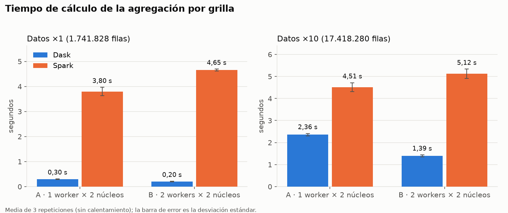
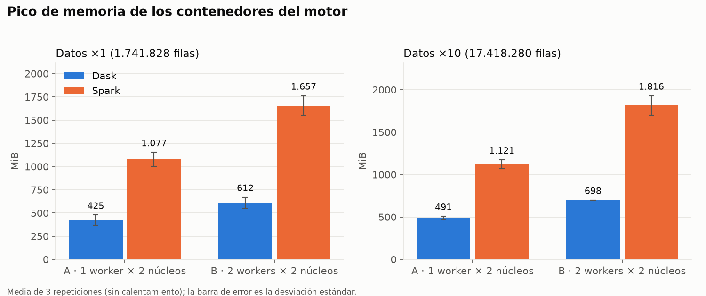

# F8 — Benchmark Dask vs Spark

Fecha: 5 y 6-oct-2026
Responsable: Santiago Villamizar
Equipo: PC de Santiago (Windows 11, AMD Ryzen, 16 GB de RAM, Docker Desktop 4.93 con WSL 2)
Rama: `feature/benchmark`

## Qué se midió

La misma operación en los dos motores (decisiones D5 y D16): leer `latitude` y `longitude` del
Parquet que escribe la ingesta, asignar cada punto a su celda de 0,005° (grilla de F6, D13),
contar por celda y obtener el top 20 y el total de filas.

- Config A: 1 worker × 2 núcleos. Config B: 2 workers × 2 núcleos.
- Volumen ×1: `/data/parquet/eventos`, las 1.741.828 filas limpias (6 archivos).
- Volumen ×10: `/data/parquet/eventos_x10`, una **copia física** con cada archivo repetido
  10 veces (60 archivos, 295 MB, 17.418.280 filas), creada con `preparar_volumen.py` (D18).
  Son datos repetidos: los dos motores leen y agrupan 10 veces más filas, pero no hay más
  diversidad de valores.
- Por combinación: 1 corrida de calentamiento (no se reporta) y 3 repeticiones: 32 corridas
  válidas, 24 en los promedios. Mientras se medía un motor, el otro estaba detenido, y los
  workers de Dask se reiniciaron antes de medir.
- Spark con particiones de shuffle iguales a los núcleos del clúster (D17).
- Memoria: pico **observado** de la suma de los contenedores del motor (scheduler/master,
  workers y cliente/driver), muestreado con `docker stats` cada ~2 s (ver limitaciones).

Datos crudos: `benchmark/resultados.csv`. Tabla: `benchmark/resumen.md`. Corridas descartadas,
con su motivo: `benchmark/resultados_descartados.csv`.

## Resultados

| Datos | Motor | Config | Cálculo (s) | Arranque (s) | Pico de memoria observado (MiB) |
|---|---|---|---:|---:|---:|
| ×1 | Dask | A | 0,30 ± 0,01 | 0,03 | 425 ± 54 |
| ×1 | Dask | B | 0,20 ± 0,02 | 0,03 | 612 ± 59 |
| ×1 | Spark | A | 3,80 ± 0,17 | 3,38 | 1.077 ± 77 |
| ×1 | Spark | B | 4,65 ± 0,04 | 3,47 | 1.657 ± 106 |
| ×10 | Dask | A | 2,36 ± 0,05 | 0,03 | 491 ± 19 |
| ×10 | Dask | B | 1,39 ± 0,05 | 0,03 | 698 ± 2 |
| ×10 | Spark | A | 4,51 ± 0,20 | 3,38 | 1.121 ± 54 |
| ×10 | Spark | B | 5,12 ± 0,21 | 3,45 | 1.816 ± 114 |

**Consistencia.** En todas las corridas los dos motores dieron el mismo top 1: la celda
`-14799_8151` (lon −73,995 a −73,990, lat 40,755 a 40,760; oeste de Midtown, junto a la
terminal Port Authority), con n = 5.336 en ×1 y exactamente 53.360 en ×10.

## Análisis

**¿Qué motor fue más rápido?** Dask, en las cuatro combinaciones: Spark tardó 12,7 y 23,3 veces
lo que Dask con ×1 (A y B) y 1,9 y 3,7 veces con ×10. Además, Spark necesita unos 3,4 s para
crear la sesión y obtener sus executors, frente a 0,03 s de Dask para conectarse a su scheduler;
ese arranque no está incluido en el tiempo de cálculo.

**¿La diferencia cambia con el volumen?** Sí, se reduce. Al pasar de ×1 a ×10, el tiempo de Dask
creció 7,9 veces en A (0,30 → 2,36 s), casi en proporción a los datos, mientras que el de Spark
creció 1,2 veces (3,80 → 4,51 s). La mayor parte del tiempo de Spark con estos volúmenes es un
costo fijo (planificación en la JVM, lanzamiento de tareas, shuffle) que no depende de las
filas. **Hipótesis no medida:** si esa tendencia continúa, Spark podría igualar o superar a Dask
con volúmenes de uno o dos órdenes de magnitud mayores; con nuestros datos solo podemos afirmar
que la ventaja de Dask bajó de ×12,7 a ×1,9 en la configuración A.

**¿Escala al pasar de 1 a 2 workers?** Dask sí, sin llegar a lineal: ×1,50 con ×1 y ×1,69 con
×10 (×2 sería lineal); con más datos, la parte paralelizable pesa más. Spark fue más lento con
2 workers en ambos volúmenes (×0,82 y ×0,88). Los dos workers son contenedores en el mismo
computador: no agregan CPU física nueva, y al repartir el `groupBy` los datos viajan
serializados entre JVM distintas. Con máquinas separadas y más datos el resultado podría ser
otro; no lo medimos.

**Memoria.** En los picos observados, Spark usó entre 2,3 y 2,7 veces más memoria que Dask, y el
segundo worker le agregó entre 580 y 700 MiB, consistente con el costo fijo de una JVM por
executor. Como las corridas de Dask (0,2 a 2,4 s) duran menos que el intervalo de muestreo, su
pico real pudo ser mayor que el observado; la diferencia es amplia, pero no es una medición
exacta del máximo.

**Conclusión con nuestros datos.**
- Para el volumen de este proyecto (≈ 1,7 M de registros) en un solo computador, **Dask fue la
  mejor opción**: más rápido, sin costo de arranque y con menor memoria observada, en el mismo
  ecosistema de pandas que usa la ingesta.
- **La ventaja de Dask se redujo mucho al crecer el volumen** (de ×12,7 a ×1,9). Que Spark
  supere a Dask con más datos o en un clúster de varias máquinas es la hipótesis que estas
  mediciones sugieren, no un resultado demostrado.
- Por eso el proyecto usa Dask para la ingesta y la limpieza, y Spark para las agregaciones
  sobre MongoDB (F6), donde aporta el conector, el optimizador y la ejecución en el clúster.

## Limitaciones

- Todo corre en un solo computador: los workers comparten CPU, memoria y disco.
- `docker stats` toma una muestra cada ~2 s. Las corridas de Dask duran menos, así que su pico
  de memoria puede estar subestimado y su CPU promedio no es confiable (no se reporta).
- La prueba ×10 usa archivos repetidos: mide el costo de leer y agrupar 10 veces más filas,
  no el de datos más diversos (más celdas distintas).
- Corridas descartadas (`benchmark/resultados_descartados.csv`):
  - 8 de Dask ×1 iniciales: los workers conservaban la memoria de la ingesta y su pico salió
    mayor que el de ×10. Se repitieron con workers reiniciados; los tiempos no cambiaron.
  - 16 de ×10 con concatenación lógica (`dd.concat` / `unionAll`): Dask reutilizaba una sola
    lectura del Parquet y Spark lo leía 10 veces, así que la comparación estaba sesgada a favor
    de Dask. Se reemplazaron por las del Parquet físico ×10. Revisión de Sebastián Botero en
    el PR #5.
